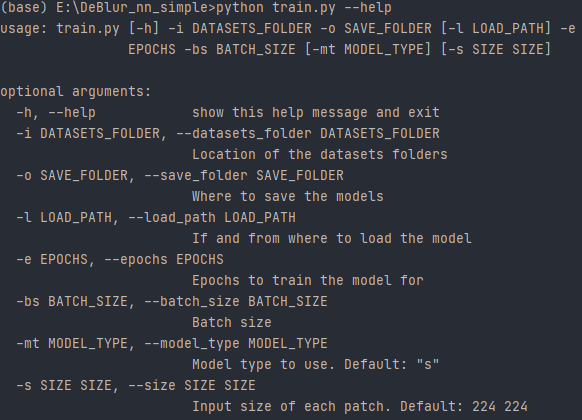

# DeBlur Neural Network (TF 1.15)
Simple but effective implementation of neural networks able to remove blur from images.

# How It Works
## Important notes
#### Neural networks available:
| Model                                         | Command            |
| --------------------------------------------- | ------------------ |
| **Simple convolutional** neural network       | (--model_type "s") |
| **Grouped** neural network                    | (--model_type "g") |
| **Generative Adversarial** neural **Network** | (--model_type "a") |

## Prediction
### Arguments

### Example of prediction
    python generate_dataset.py -i "G:/blurred_folder_of_cats" -o "G:/predicted_folder_of_cats" -l "G:/model_for_cats.h5" -s 224 224
For each image inside "G:/blurred_folder_of_cats", predict a non-blurred version and place it in "G:/predicted_folder_of_cats":
* **-l "G:/model_for_cats.h5"** => model used for the predictions.
* **-s 224 224** => each image will be divided into sections of 224 by 224 pixels.

#### Important notes
* Inside "./model", there is a ready-to-use model.

## Training
### Arguments

### Dataset
    .
    ├── ...
    ├── Training
    │   ├── Sharp           # Folder containing sharp images
    │   └── Blurred         # Folder containing blurred images
    ├── Validation
    │   ├── Sharp           # Folder containing sharp images
    │   └── Blurred         # Folder containing blurred images
    └── ...

#### To generate the dataset
* You can use this [project](https://github.com/giosullutrone/DeBlur_dataset_generator) which creates the correct folders.
* You can create your own dataset with the same folder shape.

#### Important notes on training
If you are generating your own dataset:
* Blurred and sharp versions of the same image should have the same name and extension.

### Example of training
    python train.py -i "G:/dataset_of_cats" -o "H:/models_for_cats" -e 10 -bs 32 -s 224 224 -l "H:/models_for_cats/model_for_cats.h5"
* **-l "G:/model_for_cats.h5"** => model used as a starting point for the training process.
